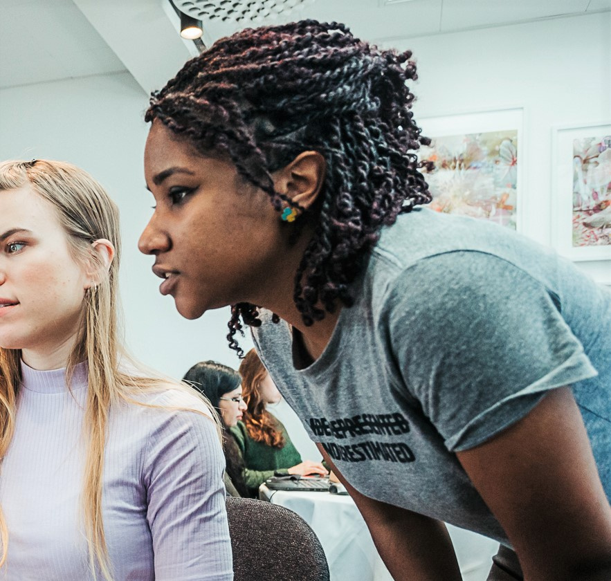
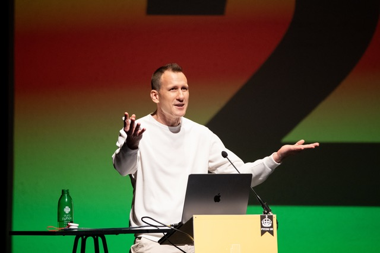

## Dawn Wages

{: width="300"}

Dawn Wages is the Director of Community and Developer Relations at Anaconda,
responsible for the most popular Python distribution in the world.
She is a software engineer, ethical open source advocate, and community leader
who previously served as Chair of the Python Software Foundation.
Her work emphasizes inclusive practices and sustainable growth in open source ecosystems,
combining technical knowledge with attention to equity, sovereignty, and developer collaboration.

When not working on Python, she enjoys watching Star Trek in Philadelphia with her wife and two dogs.

<!-- <iframe width="560" height="315" src="https://www.youtube-nocookie.com/embed/mHG3aAkbpvA" title="YouTube video player" frameborder="0" allow="accelerometer; autoplay; clipboard-write; encrypted-media; gyroscope; picture-in-picture; web-share" referrerpolicy="strict-origin-when-cross-origin" allowfullscreen></iframe> -->
<iframe src="https://www.youtube-nocookie.com/embed/mHG3aAkbpvA" title="YouTube video player" frameborder="0" allow="accelerometer; autoplay; clipboard-write; encrypted-media; gyroscope; picture-in-picture; web-share" referrerpolicy="strict-origin-when-cross-origin" allowfullscreen></iframe>

You can view the slides [here](https://dawnwages.info/pytexas-keynote-26/){target="_blank" rel="noopener"}.

## Hynek Schlawack

{: width="300"}

Hynek Schlawack is a lead infrastructure and software engineer from Berlin, Germany,
PSF fellow, blogger, YouTuber, and maintainer of *way* too many open source projects.
His main areas of interest are networks, security, and robust software.

<!-- <iframe width="560" height="315" src="https://www.youtube-nocookie.com/embed/MDqQTtjbVX8" title="YouTube video player" frameborder="0" allow="accelerometer; autoplay; clipboard-write; encrypted-media; gyroscope; picture-in-picture; web-share" referrerpolicy="strict-origin-when-cross-origin" allowfullscreen></iframe> -->
<iframe src="https://www.youtube-nocookie.com/embed/MDqQTtjbVX8" title="YouTube video player" frameborder="0" allow="accelerometer; autoplay; clipboard-write; encrypted-media; gyroscope; picture-in-picture; web-share" referrerpolicy="strict-origin-when-cross-origin" allowfullscreen></iframe>

You can view the slides [here](https://hynek.me/talks/design-pressure/){target="_blank" rel="noopener"}. Additional sites provided:

- [ox.cx/design](http://ox.cx/design){target="_blank" rel="noopener"}
- [vrmd.de](http://vrmd.de){target="_blank" rel="noopener"}
- [hynek.me](http://hynek.me){target="_blank" rel="noopener"}
- [youtube.com/@THE_HYNEK](http://youtube.com/@THE_HYNEK){target="_blank" rel="noopener"}

