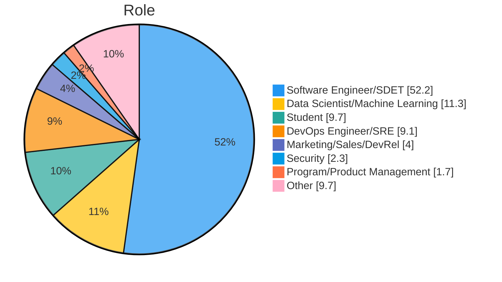
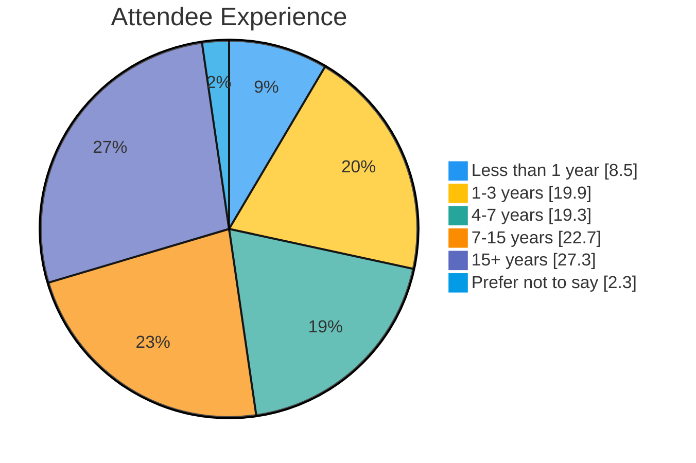
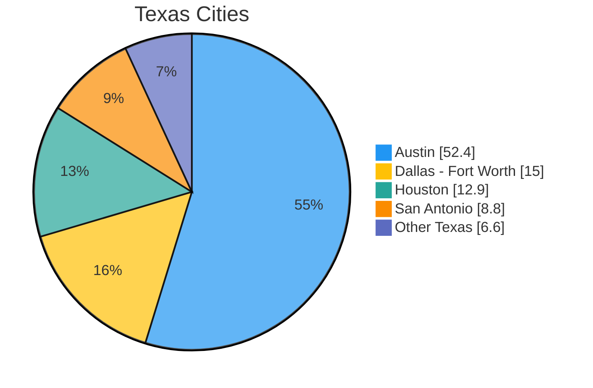

# PyTexas 2026 — Recruiter Sponsorship

**By Invitation Only** — This sponsorship tier is offered exclusively to recruiting and talent acquisition teams looking to connect directly with Python engineers in Texas.

---

## Why PyTexas?

PyTexas 2026 (April 17–19, Austin) is the oldest regional Python conference in North America, now in its 20th year. It's a concentrated pool of Python talent, with **200–250 attendees**. 83% are Texas-based.

These are engineers who invest their own weekend to attend a technical conference---exactly the kind of engaged, high-quality candidates you want in your pipeline.

### Who Attends

### Experience Level

### Where They're From

83% of attendees are from Texas, with heavy concentration in the major metros where you're most likely hiring.

!!! info "They're looking for you, too"
    This year we added a field to our ticket purchase asking attendees whether they're currently looking for a new role. **Around 40% so far said yes.** That's not a survey with selection bias; that's self-reported data from people who already bought a ticket. Nearly half the room is actively open to their next opportunity.

---

## Two Options

|  | Recruiter Day Pass | Recruiter Networking Sponsor |
| -- | :--: | :--: |
| **Cost (USD)** | **$1,500** | **$4,000** |
| Availability | 20 | 3 (shared with happy hour sponsorship) |
| Tickets included | 1 | 2 |
| Table | Half table, one day (you pick Sat or Sun; first come, first serve) | Full table at Networking Event (Sat evening) |
| Pitch | 30-second intro after morning keynote | 1–2 minute pitch at the Networking Event |
| Career Corner | Drop-in resume reviews at your booth | **Scheduled 30–45 min Career Corner** during Networking Event, promoted to all attendees |
| Job board posting | Standard | **Featured placement** (top of page, highlighted) |
| Logo on website | Yes | Yes |
| Logo on opening/closing slides | Yes | Yes |
| Social media callout | Yes | Yes |
| Shared swag table | Yes | Yes |

**Want a full table both days of the main conference?** Our [Silver tier ($3,000)](sponsor-us.md) includes a full table Saturday and Sunday, 1 ticket, a 1-minute pitch, and all standard sponsor benefits.

---

## The Career Corner

The Career Corner is an exclusive activation available only through our Recruiter sponsorship tiers. You provide resume reviews and career advice to attendees, and they love you for it. And you can collect info on an opt-in basis with people who come to connect with you.

### How It Works

**Networking Sponsor ($4,000):**
We give you a dedicated table during the Saturday evening Networking Event (6:30–9:00 PM). PyTexas promotes the Career Corner to all attendees in advance. Attendees may sign up for one-on-one resume review slots with your team (if you'd like). You get engineers in a social setting who are voluntarily putting their resume in your hands.

**Day Pass ($1,500):**
You run resume reviews informally at your booth throughout your day. Put up a sign, spread the word, and attendees stop by between talks for quick feedback. You're welcome to request contact info or resumes at your table for opt-in future communication.

### Why This Works

**For you:** You'll have Python engineers voluntarily handing you their resumes and asking for your professional opinion. That's better pipeline than a month of LinkedIn InMails. You see their actual qualifications, have a genuine conversation, and build a relationship, all in a setting where they came to you.

**For attendees:** Free professional resume feedback from actual hiring professionals. Especially valuable for the ~29% of attendees who are early in their careers. It's the kind of thing people remember and tell their friends about.

**For everyone:** It doesn't feel transactional. It feels like community. And that's exactly the kind of sponsor activation that makes people want to work with you.

---

## The Case for the Networking Event

The Saturday Networking Event (6:30–9:00 PM) is the single best recruiting environment at the conference:

- **2.5 hours** of unstructured time with attendees in a social setting
- Attendees are relaxed, open to conversation, and not rushing to the next talk
- Your **1–2 minute pitch** lands with a receptive audience
- The **scheduled Career Corner** gives you a built-in reason for deep, one-on-one conversations
- You're not competing with talks for attention — you ARE the event

For $4,000, you're getting more meaningful candidate interactions in one evening than most companies get from an entire conference season.

---

## Ready to Sponsor?

Contact us at [sponsorship@pytexas.org](mailto:sponsorship@pytexas.org) to reserve your spot.

Spots are limited. We want to keep the recruiter presence balanced so it enhances the attendee experience rather than overwhelming it.
